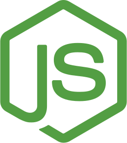

<!-- <header
  style="padding-bottom: 16px; display: flex; flex-direction: row; justify-content: space-between;"
>

  <h1>Cristian Sosa G.</h1>

  

    Soy un frontend developer, sin embargo encontraras algunos repos de diseño y backend también
  

</header> -->

## Sobre mi 🙆🏽‍♂️

Mi nombre es Cristian, soy técnico informático y la tecnología me atrajo mucho más al descubrir el mundo del desarrollo web.

En principio me orienté al frontend, porque tenía conocimientos en diseño gráfico y dibujo técnico, pero al ir avanzando en mi camino descubrí que me encanta todo

📙 | Actualmente estoy cursando un intituto de desarrollo web y estudiando para la Licenciatura en Computación del FAMAFyC

📚 | Siempre estudié por mi cuenta, leyendo la documentación y demás. Estoy profundizando conocimientos en ReactJs

Por el momento me estoy enfocando en Frontend, pero también podrás encontrar cosas de Backend y diseño

  

## Mis metas 🎯

Soy una persona apasionada por el trabajo en equipo, actualmente me estoy enfocando en ganar conocimiento para poder aportar todo de mi como Full Stack

Si querés ver un poco más de mi como persona te invito a seguirme en [instagram](https://www.instagram.com/crisg.sosa/ "Perfil de Instagram")

 

## Mis Conocimientos 👨🏽‍🎓

<ul style="margin-top: 24px; list-style: none; display: flex; flex-direction: column; gap: 8px;">  
  <li></li>
</ul>

<ul style="margin-top: 16px; list-style: none; display: flex; flex-direction: column; gap: 8px;">
  <li></li>
  
  <li>
    
    
  </li>

  <li>
    
    
  </li>

</ul>

<ul style="margin-top: 16px; list-style: none; display: flex; flex-direction: column; gap: 8px;">
  <li>
    
    
  </li>
  
  <li></li>

  <li>
    
  </li>

</ul>

<ul style="margin-top: 16px; list-style: none; display: flex; flex-direction: column; gap: 8px;">
  <li></li>

</ul>
