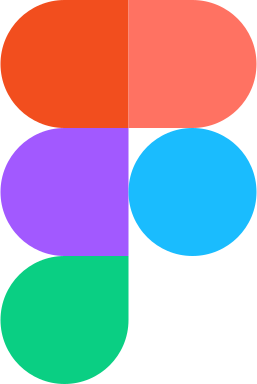
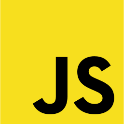
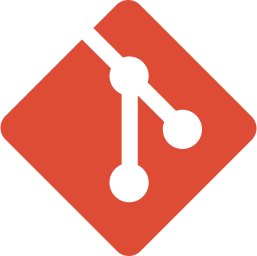

<header
  style="padding-bottom: 16px; display: flex; justify-content: space-between;"
>

<figure
  style="width: 120px; display: flex; justify-content: flex-start; align-items: center;"
>
  
</figure>

  

    Hola! Soy Cristian
  

  

    Soy un frontend developer, sin embargo encontraras algunos repos de diseño y backend también
  

</header>

## Sobre mi 🙆🏽‍♂️

Soy técnico informático y me atrajo mucho más al desacubrir el mundo del desarrollo web.

En principio me orienté al frontend, porque tenía conocimientos en diseño gráfico y dibujo técnico, pero al ir avanzando en mi camino descubrí que me encanta todo

 

📙 | Actualmente estoy cursando un intituto de desarrollo web y estudiando para la Licenciatura en Computación del FAMAFyC

📚 | Siempre estudié por mi cuenta, leyendo la documentación y demás. Estoy profundizando conocimientos en ReactJs

  

## Mis metas 🎯

Soy una persona apasionada por el trabajo en equipo, actualmente me estoy enfocando en ganar conocimiento para poder aportar todo de mi como Full Stack

Si querés ver un poco más de mi como persona te invito a seguirme en [instagram](https://www.instagram.com/crisg.sosa/ "Perfil de Instagram")

 

## Mis Conocimientos 👨🏽‍🎓

<ul style="margin-top: 24px; list-style: none; display: flex; flex-direction: column; gap: 8px;">  
  <li></li>
</ul>

<ul style="margin-top: 24px; list-style: none; display: flex; flex-direction: column; gap: 8px;">
  <li></li>
  
  <li>
    
    
  </li>

  <li>
    
    
  </li>

</ul>

<ul style="margin-top: 24px; list-style: none; display: flex; flex-direction: column; gap: 8px;">
  <li>
    
    
  </li>
  
  <li></li>

  <li>
    
  </li>

</ul>

<ul style="margin-top: 24px; list-style: none; display: flex; flex-direction: column; gap: 8px;">
  <li></li>

</ul>
